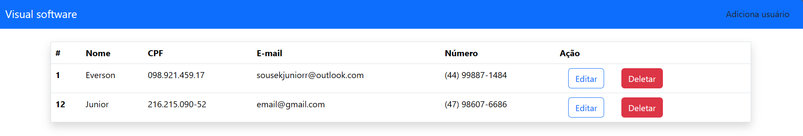

# Front-end Processo Seletivo Visual Software

    
    
    

Este é o front-end do projeto, feito um crud com react com uma conexão ao banco de dados mysql

## :hammer: Funcionalidade do projeto

Um sistema com as funcionalidades de adicionar, editar e deletar usuários com todas essas operações ligadas ao um banco de dados mysql

## :wrench: Técnicas e tecnologias utilizadas

- ⚛️ `React`
- 📡 `React router dom`
- 🅱️ `Bootstrap`
- ↕️ `Axios`

## :file_folder: Acesso ao projeto

Primeira opção:
Você pode acessa o projeto e baixar ele pelo <a href="https://github.com/EversonSoucek/visual-processoseletivoFrontEnd">Github</a>

## :computer: Rodar o projeto
 
Com o servidor do back-end rodando abrir e rodar o projeto execute no terminal `npm i` para instalar as dependências e `npm start` para iniciar o projeto

Depois, acesse <a href="http://localhost:3000/">http://localhost:3000/</a> no seu navegador

## :pencil: Autores

 Everson Adolfo Soucek Junior(https://github.com/EversonSoucek)